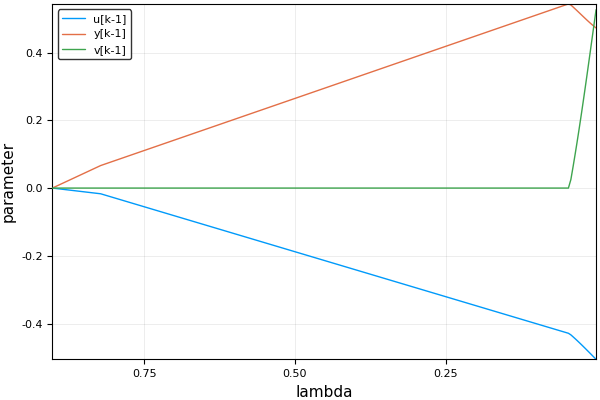
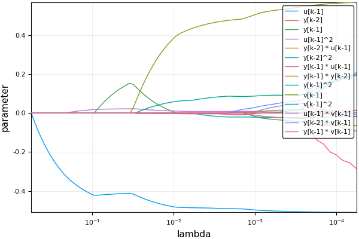

```@meta
DocTestSetup = quote
    using NarmaxLasso
    # Generate input
    u = generate_random_input(2000, 5);
    # Defining nonlinear system
    armax_mdl(y, u, v) = 0.5*y[1] - 0.5*u[1] + 0.5*v[1];
    yterms0 = [1]; uterms0 = [1]; vterms0 = [1];
    # Generate Output
    y = simulate(u, armax_mdl, yterms0, uterms0, vterms0;
                 σv=0.3);         
end
```

# Package Guide

This package allows the estimation of parameters of discrete dynamic models from observed data.

## Linear Model

Consider vectors of observed inputs and outputs: ``u`` and ``y``. Assume, for instance, we want to fit the following model to the observed data:
```math
y[k] = \beta_1 y[k-1] + \beta_2 u[k-1] + \beta_3 v[k-1]
```
where the parameters ``\beta_1``, ``\beta_2`` and ``\beta_3`` are unknown. The noise term ``v[k-1]`` is included to model the random effects that affects the observation.

The estimation can be done in two steps. The first step consists of generating the regressors to the problem, which can be done using the command [`generate_all`](@ref) by the following command sequence:

```julia
julia> ny = 1; nu = 1; nv = 1; order = 1;
julia> mdl = generate_all(NarmaxRegressors, Monomial, ny, nu, nv, order)
u[k-1]
y[k-1]
v[k-1]
```

Next the command [`narmax_lasso`](@ref) can be used to solve, for a grid of values of ``\lambda``, the following minimization problem:
```math
\min_\beta ||\mathbf{e}||^2 + \lambda * \sum_{i=1}^3 |\beta_i|
```
where ``\mathbf{e}`` is the error between the model prediction and the observed values, subject to an $L_1$-norm penalty. The above minimization problem can be solved using the following command:
```julia
julia> result = narmax_lasso(y, u, mdl);
```
The output can be visualized using:
```JULIA
julia> using Plots
julia> plot(result)
```
A possible output would be:



The value of λ may be chosen by testing the models on a validation set.

##  Polynomial Model
Now assume that the following polynomial model:
```math
  y[k] = \sum_{i}\beta_i \left(y[k-q_i] \right)^{l_i} \left(u[k-t_i] \right)^{r_i}
  \left(e[k-w_i] \right)^{s_i}
```
is to be adjusted to a data set. For which the monomials included as regressors are all possible monomials for which: ``1\le q_i \le n_y``; ``1 \le t_i \le n_u``; ``1 \le w_i \le n_e``; and, ``l_i + r_i + s_i \le \text{order}``.

All possible monomials can be generated using the command [`generate_all`](@ref). For ``n_y=2``, ``n_u=1``, ``n_v=1`` and ``\text{order}=2`` the generated terms are:
```julia
julia> ny = 2; nu = 1; nv = 1; order = 1:2;
julia> mdl = generate_all(NarmaxRegressors, Monomial, ny, nu, nv, order)
u[k-1]
y[k-2]
y[k-1]
u[k-1]^2
y[k-2] * u[k-1]
y[k-2]^2
y[k-1] * u[k-1]
y[k-1] * y[k-2]
y[k-1]^2
v[k-1]
v[k-1]^2
u[k-1] * v[k-1]
y[k-2] * v[k-1]
y[k-1] * v[k-1]
```

Again the command [`narmax_lasso`](@ref) can be used to solve the lasso regression problem  for a grid of values of ``\lambda``:
```julia
julia> result = narmax_lasso(y, u, mdl);
```
The output can be visualized (in logscale) using:
```JULIA
julia> using Plots
julia> plot(result, xscale=:log10)
```
A possible output would be:



Again, the value of λ may be chosen by testing the models on a validation set.
